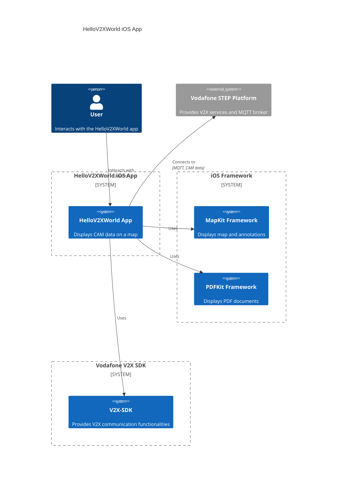

```mermaid
C4Context
title HelloV2XWorld iOS App

Person(user, "User", "Interacts with the HelloV2XWorld app")

System_Boundary(c1, "HelloV2XWorld iOS App") {
  Rel(user, HelloV2XWorld_App, "Interacts with", "touch")
  System(HelloV2XWorld_App, "HelloV2XWorld App", "Displays CAM data on a map")
}

System_Ext(STEP_Platform, "Vodafone STEP Platform", "Provides V2X services and MQTT broker")
Rel(HelloV2XWorld_App, STEP_Platform, "Connects to", "MQTT, CAM data")

System_Boundary(c2, "iOS Framework") {
    System(MapKit, "MapKit Framework", "Displays map and annotations")
    System(PDFKit, "PDFKit Framework", "Displays PDF documents")
}
Rel(HelloV2XWorld_App, MapKit, "Uses", "")
Rel(HelloV2XWorld_App, PDFKit, "Uses", "")

System_Boundary(c3, "Vodafone V2X SDK") {
  System(V2X_SDK, "V2X-SDK", "Provides V2X communication functionalities")
}
Rel(HelloV2XWorld_App, V2X_SDK, "Uses", "")


```
