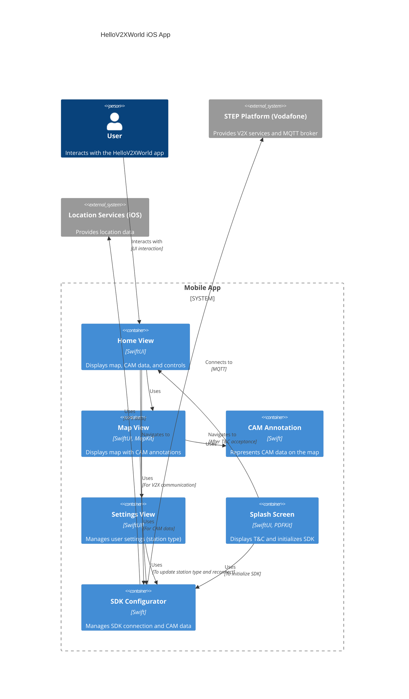

```mermaid
C4Context
title HelloV2XWorld iOS App

Person(user, "User", "Interacts with the HelloV2XWorld app")

System_Boundary(c1, "Mobile App") {
  Rel(user, HomeView, "Interacts with", "UI interaction")
  Container(HomeView, "Home View", "SwiftUI", "Displays map, CAM data, and controls")
  Container(MapView, "Map View", "SwiftUI, MapKit", "Displays map with CAM annotations")
  Container(CamAnnotation, "CAM Annotation", "Swift", "Represents CAM data on the map")
  Container(SettingsView, "Settings View", "SwiftUI", "Manages user settings (station type)")
  Container(SplashScreenView, "Splash Screen", "SwiftUI, PDFKit", "Displays T&C and initializes SDK")
  Rel(HomeView, MapView, "Uses", "")
  Rel(MapView, CamAnnotation, "Uses", "")
  Rel(HomeView, SettingsView, "Navigates to", "")
  Rel(SplashScreenView, HomeView, "Navigates to", "After T&C acceptance")
  Container(SDKConfigurator, "SDK Configurator", "Swift", "Manages SDK connection and CAM data")
  Rel(HomeView, SDKConfigurator, "Uses", "For V2X communication")
  Rel(MapView, SDKConfigurator, "Uses", "For CAM data")
  Rel(SettingsView, SDKConfigurator, "Uses", "To update station type and reconnect")
  Rel(SplashScreenView, SDKConfigurator, "Uses", "To initialize SDK")
}

System_Ext(step, "STEP Platform (Vodafone)", "Provides V2X services and MQTT broker")
Rel(SDKConfigurator, step, "Connects to", "MQTT", "Application ID, SDK Key")

System_Ext(locationServices, "Location Services (iOS)", "Provides location data")
Rel(SDKConfigurator, locationServices, "Uses", "GPS data")


```
