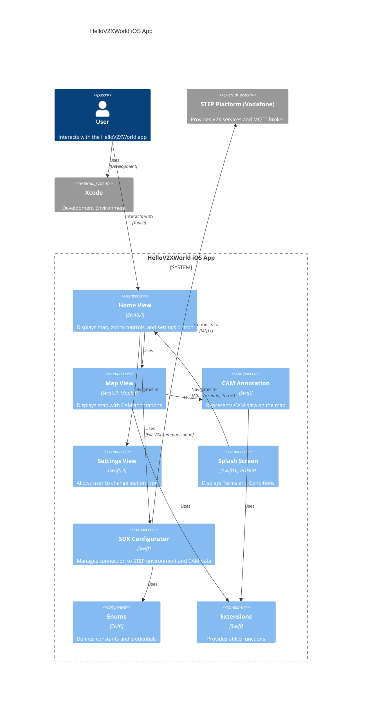

```mermaid
C4Context
title HelloV2XWorld iOS App

Person(user, "User", "Interacts with the HelloV2XWorld app")

System_Boundary(c1, "HelloV2XWorld iOS App") {
  Rel(user, HomeView, "Interacts with", "Touch")
  Component(HomeView, "Home View", "SwiftUI", "Displays map, zoom controls, and settings button")
  Component(MapView, "Map View", "SwiftUI, MapKit", "Displays map with CAM annotations")
  Component(CamAnnotation, "CAM Annotation", "Swift", "Represents CAM data on the map")
  Component(SettingsView, "Settings View", "SwiftUI", "Allows user to change station type")
  Component(SplashScreenView, "Splash Screen", "SwiftUI, PDFKit", "Displays Terms and Conditions")
  Component(SDKConfigurator, "SDK Configurator", "Swift", "Manages connection to STEP environment and CAM data")
  Component(Enums, "Enums", "Swift", "Defines constants and credentials")
  Component(Extensions, "Extensions", "Swift", "Provides utility functions")

}

System_Ext(step, "STEP Platform (Vodafone)", "Provides V2X services and MQTT broker")
Rel(SDKConfigurator, step, "Connects to", "MQTT")

System_Ext(xcode, "Xcode", "Development Environment")
Rel(user, xcode, "Uses", "Development")


Rel(HomeView, MapView, "Uses", "")
Rel(MapView, CamAnnotation, "Uses", "")
Rel(HomeView, SettingsView, "Navigates to", "")
Rel(SplashScreenView, HomeView, "Navigates to", "After accepting terms")
Rel(HomeView, SDKConfigurator, "Uses", "For V2X communication")
Rel(SDKConfigurator, Enums, "Uses", "")
Rel(MapView, Extensions, "Uses", "")
Rel(CamAnnotation, Extensions, "Uses", "")


```
