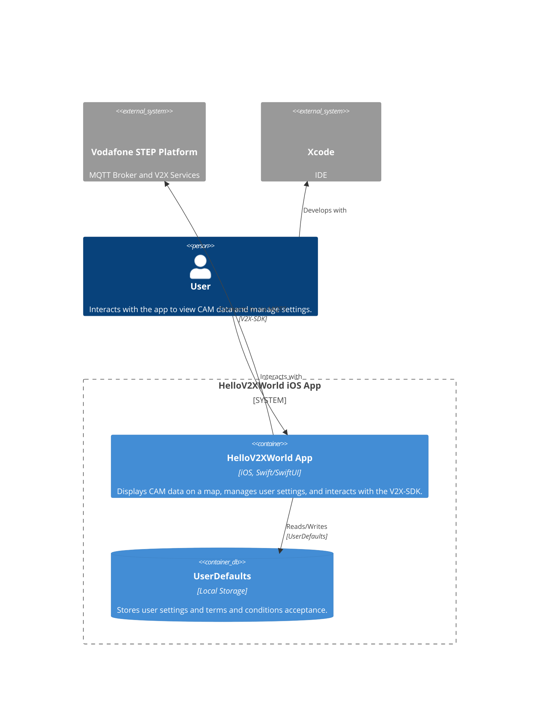

```mermaid
C4Context
  System_Boundary(c1, "HelloV2XWorld iOS App") {
    Container(app, "HelloV2XWorld App", "iOS, Swift/SwiftUI", "Displays CAM data on a map, manages user settings, and interacts with the V2X-SDK.")
    ContainerDb(UserDefaults, "UserDefaults", "Local Storage", "Stores user settings and terms and conditions acceptance.")

    Rel(app, UserDefaults, "Reads/Writes", "UserDefaults")
  }

  System_Ext(step, "Vodafone STEP Platform", "MQTT Broker and V2X Services", "Provides V2X communication infrastructure and CAM data.")
  System_Ext(xcode, "Xcode", "IDE", "Development environment for building the app.")
  Person(user, "User", "Interacts with the app to view CAM data and manage settings.")

  Rel(user, app, "Interacts with", "")
  Rel(app, step, "Connects to via MQTT", "V2X-SDK")
  Rel(user, xcode, "Develops with", "")

```
