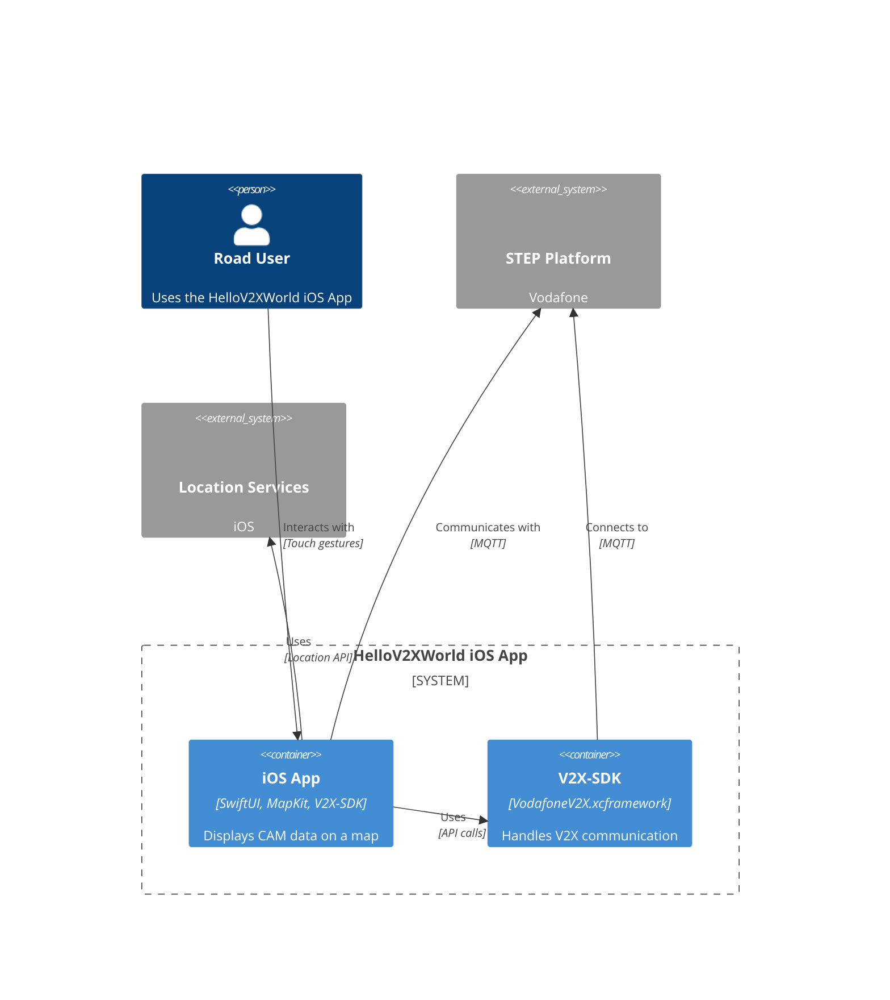

```mermaid
C4Context
  Person(user, "Road User", "Uses the HelloV2XWorld iOS App")

  System_Boundary(c1, "HelloV2XWorld iOS App") {
    Container(ios_app, "iOS App", "SwiftUI, MapKit, V2X-SDK", "Displays CAM data on a map")
    Container(v2x_sdk, "V2X-SDK", "VodafoneV2X.xcframework", "Handles V2X communication")

    Rel(ios_app, v2x_sdk, "Uses", "API calls")
  }

  System_Ext(step_platform, "STEP Platform", "Vodafone", "Provides V2X services, MQTT broker")
  System_Ext(location_services, "Location Services", "iOS", "Provides location data")

  Rel(user, ios_app, "Interacts with", "Touch gestures")
  Rel(ios_app, step_platform, "Communicates with", "MQTT")
  Rel(ios_app, location_services, "Uses", "Location API")

  Rel(v2x_sdk, step_platform, "Connects to", "MQTT")

```
