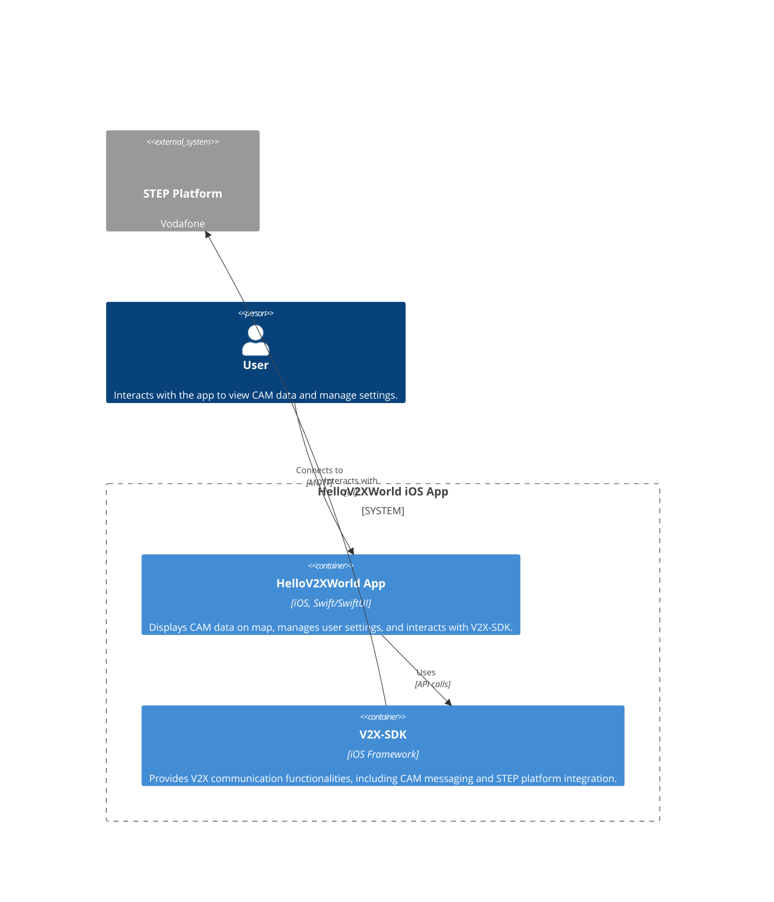

```mermaid
C4Context
  System_Boundary(c1, "HelloV2XWorld iOS App") {
    Container(ios_app, "HelloV2XWorld App", "iOS, Swift/SwiftUI", "Displays CAM data on map, manages user settings, and interacts with V2X-SDK.")
    Container(v2x_sdk, "V2X-SDK", "iOS Framework", "Provides V2X communication functionalities, including CAM messaging and STEP platform integration.")

  }
  System_Ext(step_platform, "STEP Platform", "Vodafone", "Provides MQTT broker and V2X services.")
  Rel(ios_app, v2x_sdk, "Uses", "API calls")
  Rel(v2x_sdk, step_platform, "Connects to", "MQTT")
  Person(user, "User", "Interacts with the app to view CAM data and manage settings.")
  Rel(user, ios_app, "Interacts with", "UI")
```
