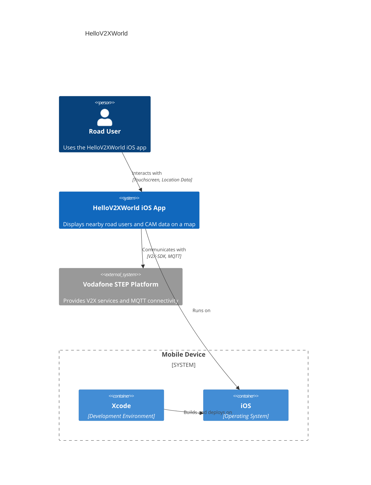

```mermaid
C4Context
title HelloV2XWorld

Person(user, "Road User", "Uses the HelloV2XWorld iOS app")

System(ios_app, "HelloV2XWorld iOS App", "Displays nearby road users and CAM data on a map")

System_Ext(step_platform, "Vodafone STEP Platform", "Provides V2X services and MQTT connectivity")

Rel(user, ios_app, "Interacts with", "Touchscreen, Location Data")
Rel(ios_app, step_platform, "Communicates with", "V2X-SDK, MQTT")

System_Boundary(c1, "Mobile Device") {
  Container(xcode, "Xcode", "Development Environment")
  Container(ios, "iOS", "Operating System")
  Rel(xcode, ios, "Builds and deploys on", "")
  Rel(ios_app, ios, "Runs on", "")
}
```
