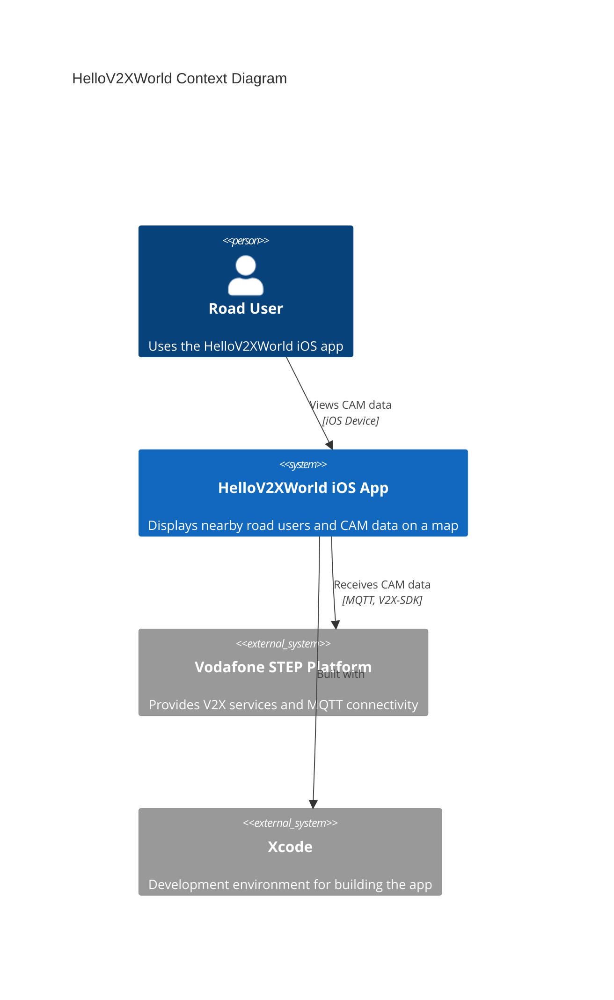

```mermaid
C4Context
title HelloV2XWorld Context Diagram

Person(user, "Road User", "Uses the HelloV2XWorld iOS app")

System(ios_app, "HelloV2XWorld iOS App", "Displays nearby road users and CAM data on a map")

System_Ext(step_platform, "Vodafone STEP Platform", "Provides V2X services and MQTT connectivity")

System_Ext(xcode, "Xcode", "Development environment for building the app")

Rel(user, ios_app, "Views CAM data", "iOS Device")

Rel(ios_app, step_platform, "Receives CAM data", "MQTT, V2X-SDK")

Rel(ios_app, xcode, "Built with", "")

```
