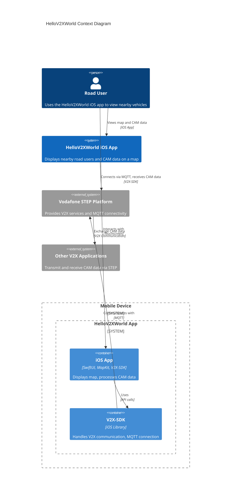

```mermaid
C4Context
title HelloV2XWorld Context Diagram

Person(user, "Road User", "Uses the HelloV2XWorld iOS app to view nearby vehicles")

System(hellov2x_app, "HelloV2XWorld iOS App", "Displays nearby road users and CAM data on a map")

Rel(user, hellov2x_app, "Views map and CAM data", "iOS App")

System_Ext(step_platform, "Vodafone STEP Platform", "Provides V2X services and MQTT connectivity")

Rel(hellov2x_app, step_platform, "Connects via MQTT, receives CAM data", "V2X-SDK")

System_Ext(other_v2x_apps, "Other V2X Applications", "Transmit and receive CAM data via STEP")

Rel(step_platform, other_v2x_apps, "Exchange CAM data", "V2X Communication")

System_Boundary(c1, "Mobile Device") {
  System_Boundary(c2, "HelloV2XWorld App") {
    Container(ios_app, "iOS App", "SwiftUI, MapKit, V2X-SDK", "Displays map, processes CAM data")
    Container(v2x_sdk, "V2X-SDK", "iOS Library", "Handles V2X communication, MQTT connection")
  }
}


Rel(user, ios_app, "Interacts with", "Touchscreen")
Rel(ios_app, v2x_sdk, "Uses", "API calls")
Rel(v2x_sdk, step_platform, "Communicates with", "MQTT")

```
